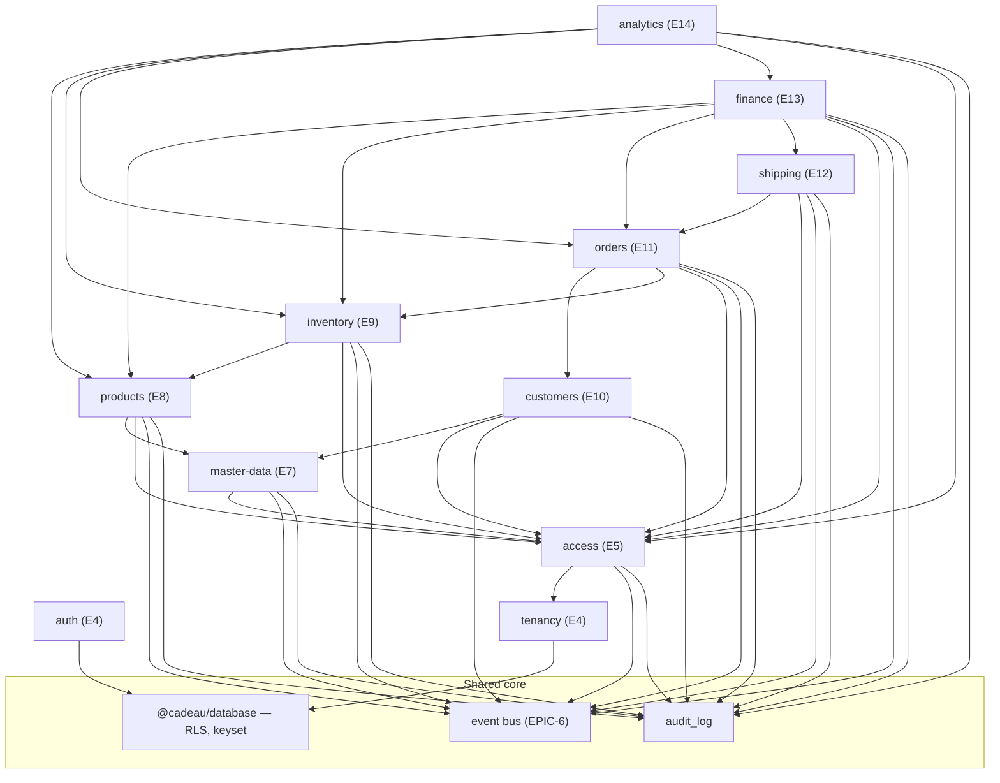

# Domain Map — Cadeau CRM

**As of:** end of EPIC-15 — 2026-08-01 · 13 delivered modules · 61 tables · 122 endpoints.

One page that answers "what exists, what owns what, and what depends on what."
Read it before starting a new epic — it is how you find the seam to attach to
instead of inventing a new one. Per-module detail lives in
[api/](api/README.md) (contracts) and the domain docs linked below.

---

## 1. Layer map

```
                     ┌──────────────────────────────────────────┐
   Domain modules    │ products · inventory · customers ·       │  EPIC-8, 9, 10,
                     │ orders · shipping · finance · analytics · │  11, 12, 13, 14,
                     │ notifications                             │  15
                     └───────────────────┬──────────────────────┘
                                         │ consumes
                     ┌───────────────────┴──────────────────────┐
   Platform modules  │ master-data · access · tenancy · auth    │  EPIC-4, 5, 7
                     └───────────────────┬──────────────────────┘
                                         │ built on
                     ┌───────────────────┴──────────────────────┐
   Shared core       │ event bus (EPIC-6) · audit_log ·         │
                     │ unified errors · RLS + keyset helpers    │
                     │ (@cadeau/config, @cadeau/crypto,         │
                     │  @cadeau/database)                       │
                     └──────────────────────────────────────────┘
```

Nothing points upward. A domain module may consume platform modules and the shared
core; a platform module never imports a domain module.

## 2. Delivered modules

| Module          | Epic | Base path(s)                      | Owns (tables)                                                                                                                                                                                                                                                                                                                                        | Events                                                                                            |
| --------------- | ---- | --------------------------------- | ---------------------------------------------------------------------------------------------------------------------------------------------------------------------------------------------------------------------------------------------------------------------------------------------------------------------------------------------------- | ------------------------------------------------------------------------------------------------- |
| `auth`          | 4    | `/v1/auth`                        | `profiles`, `sessions`                                                                                                                                                                                                                                                                                                                               | —                                                                                                 |
| `tenancy`       | 4    | `/v1/companies` …                 | `companies`, `company_members`, `invitations`                                                                                                                                                                                                                                                                                                        | —                                                                                                 |
| `access`        | 5    | `/v1/access`, `/v1/admin`         | `features`, `plans`, `plan_features`, `permissions`, `feature_permissions`, `permission_templates`, `role_permissions`, `platform_admins`, `subscriptions`, `company_feature_flags`, `add_ons`, `member_permissions`                                                                                                                                 | `subscription.changed`, access `*` (additive)                                                     |
| `master-data`   | 7    | `/v1/master-data`                 | `currencies`, `country_configs`, `governorates`, `units`, `product_categories`, `order_labels`, `order_reasons`, `shipping_zones`                                                                                                                                                                                                                    | `master_data.changed`                                                                             |
| `products`      | 8    | `/v1/products`                    | `products`, `product_variants`                                                                                                                                                                                                                                                                                                                       | `product.created` / `.updated` / `.archived`                                                      |
| `inventory`     | 9    | `/v1/warehouses`, `/v1/inventory` | `warehouses`, `inventory_stock`, `stock_reservations`, `stock_transfers`, `stock_adjustments`                                                                                                                                                                                                                                                        | `stock.changed`, `stock.low`                                                                      |
| `customers`     | 10   | `/v1/customers`                   | `customers`, `customer_addresses`                                                                                                                                                                                                                                                                                                                    | `customer.created` / `.updated` / `.exported`                                                     |
| `orders`        | 11   | `/v1/orders`                      | `orders`, `order_items`, `order_activities`, `order_sequences`                                                                                                                                                                                                                                                                                       | `order.created` / `.status_changed` / `.assigned`, `payment.collected`, `customer.merged`         |
| `finance`       | 13   | `/v1/finance`                     | `suppliers`, `purchase_order_sequences`, `purchase_orders`, `purchase_order_lines`, `purchase_order_receipts`, `purchase_order_receipt_lines`, `purchase_order_payments`, `expenses`, `tax_settings`, `invoice_sequences`, `invoices`, `invoice_lines`, `refunds`, `shipping_reconciliations`, `shipping_reconciliation_lines`, `accounting_periods` | `purchase_order.received`, `payment.recorded`, `invoice.issued`, `refund.issued`, `period.closed` |
| `shipping`      | 12   | `/v1/shipping`                    | `shipments`, `shipping_webhook_events`                                                                                                                                                                                                                                                                                                               | `shipment.created` / `.status_changed` / `.delivered`                                             |
| `analytics`     | 14   | `/v1/analytics`                   | — (no owned tables, D3)                                                                                                                                                                                                                                                                                                                              | —                                                                                                 |
| `notifications` | 15   | `/v1/notifications`               | `notifications`, `notification_preferences`, `push_subscriptions`, `notification_deliveries`                                                                                                                                                                                                                                                         | `notification.created` / `.delivered`; **consumes** `order.status_changed`, `payment.collected`   |
| `health`        | 1    | `/health`                         | —                                                                                                                                                                                                                                                                                                                                                    | —                                                                                                 |

Shared, owned by no feature module: `audit_log` (append-only, written by every
module before it emits).

## 3. Dependency graph (delivered)



Note: `analytics` does not depend on the event bus (`BUS`) — it is read-only
and emits no domain event, so it has no publisher edge into `BUS`. It still
writes to `AUDIT` (the export's audit-then-nothing row, D7).

Read an arrow as "depends on". Every module depends on `@cadeau/database` for the
tenant context, keyset helpers, and audit write; the edges above show the
_feature-level_ dependencies that matter when planning.

## 4. The four cross-cutting seams

Every module attaches through the same four seams. A new epic that needs a fifth
seam should be treated as a core change and reviewed as such.

1. **Access (EPIC-5, three-layer).** Feature enabled for the plan → permission
   granted to the member → route gated. Feature keys and `read`/`manage`
   permissions are seeded from
   [`packages/database/src/seed/access/catalog.ts`](../packages/database/src/seed/access/catalog.ts).
   All 16 epics' feature keys are **already in the catalog** — a new domain module
   normally adds no catalog row.
2. **Tenant isolation (ADR-0001/0003).** Two layers, always: Postgres `FORCE` RLS
   by `company_id`, plus repository-side `setTenantContext` + `companyId` filter.
   The tenant comes from the token, never the payload.
3. **Audit-then-emit (ADR-0004).** Every write appends an `audit_log` row first
   (source of truth), then publishes on the in-process typed bus (additive). The
   event catalog in
   [`apps/api/src/shared/events/event-catalog.ts`](../apps/api/src/shared/events/event-catalog.ts)
   is **closed**. Every publisher through EPIC-14 had zero subscribers;
   `notifications` (EPIC-15) is the bus's first real consumer
   (`order.status_changed`/`payment.collected` → fan-out).
4. **Keyset lists.** No OFFSET anywhere. Every list is cursor-paginated over a
   covering index; the cursor is opaque and tamper-detected (`400`).

## 5. Data-flow spine

The delivered half of the product is the _catalog → stock_ spine, with the
_customer base_ standing beside it, waiting for orders to join the two:

```
master-data (units, categories)
        │ classifies
        ▼
    products ── variants ────────────┐
        │  allow_oversell            │ counted in
        ▼                            ▼
   averageCost  ◀── EPIC-13    inventory_stock (per warehouse × variant)
   (rolled on PO receipt,             │ moved by
    moving average, D7)               ▼
             reservations · transfers · adjustments  (atomic, logged)
                                     │ emits
                                     ▼
                       stock.changed / stock.low
```

```
master-data (governorates)
        │ locates
        ▼
    customers ── customer_addresses (one default)
        │
        ├─ phone: ciphertext (source of truth) + blind index (unique, exact lookup)
        └─ ordersCount / totalSpent / lastOrderAt ◀── orders (recomputed in the write txn)
```

```
customers ──────────────┐ pinned by
products ── variants ───┤ snapshotted into (name + averageCost → COGS)
inventory reservations ─┤ feature-gated: reserve on processing · ship · release
labels/reasons/gov ─────┘ classify
        ▼
     orders ── order_items ── order_activities   (12-state machine + follow-up)
        │ emits
        ▼
order.created / order.status_changed / order.assigned / payment.collected
```

```
orders ─────┐ pinned by (RESTRICT)
shipping_zones ┘ (seeded, no consumer logic yet — P1 rate cards)
        ▼
    shipments   (6-state machine, independent of the order's own)
        │ emits
        ▼
shipment.created / shipment.status_changed / shipment.delivered
        │ deducts fee from
        ▼
   order.collectedAmount   (at delivery, simple deduction — D4)
        │ reconciled against (D5)
        ▼
   shipping_reconciliations   (statement lines matched by tracking number)
```

```
suppliers ── purchase_orders ── purchase_order_lines
                  │ receipt (atomic, D7)
                  ▼
   raises inventory_stock.on_hand + rolls product_variants.averageCost
                  │
orders ── invoices ── invoice_lines          (VAT frozen at issue, PDF)
                  │
              refunds
                  │
expenses ─────────┤
purchase_order_payments ─┤
refunds ──────────┤        (D6: summed on read, not a ledger)
shipping fees ────┘
                  ▼
      cash-center / P&L reports ── accounting_periods (D4, sequential close)
```

Everything still to be built hangs off the right-hand side: analytics
(EPIC-14, delivered) reads across all of it, no new seam, no owned table;
notifications (EPIC-15) subscribe to the event bus next.

## 6. Planned modules and where they attach

| Epic | Module          | Attaches to                               | New tables (planned)                       |
| ---- | --------------- | ----------------------------------------- | ------------------------------------------ |
| 15   | `notifications` | the event bus (`stock.low`, order events) | notifications, preferences, delivery queue |
| 16   | —               | launch gate over everything               | —                                          |

## 7. Forward references already in the schema

Deliberate, documented, and unenforced until their epic lands:

| Reference                                                                 | Waiting on | Note                                                                                                                                                       |
| ------------------------------------------------------------------------- | ---------- | ---------------------------------------------------------------------------------------------------------------------------------------------------------- |
| ~~`stock_reservations.order_id`~~                                         | ✅ EPIC-11 | Now a real FK (`ON DELETE SET NULL`).                                                                                                                      |
| ~~`customers.orders_count` / `.total_spent` / `.last_order_at`~~          | ✅ EPIC-11 | Recomputed in the order write transaction (decision D3).                                                                                                   |
| ~~Customer merge (`POST /v1/customers/merge`)~~                           | ✅ EPIC-11 | Delivered over all customer-owned tables + a completeness guard test.                                                                                      |
| ~~`product_variants.average_cost`~~                                       | ✅ EPIC-13 | Written by the PO-receipt moving-average roll (D7); still read-only to every other caller.                                                                 |
| ~~`order_labels`, `order_reasons`~~                                       | ✅ EPIC-11 | Consumed by orders (labels, cancel reasons).                                                                                                               |
| ~~`shipping_zones`~~                                                      | ✅ EPIC-12 | Still no rate-card consumer (P1); a real carrier adapter is the next reference to resolve.                                                                 |
| Shipping-fee reconciliation vs. carrier remittance                        | ✅ EPIC-13 | `shipping_reconciliations`/`_lines`, matched by tracking number (D5).                                                                                      |
| Precise per-event `collectedMinor`/`cogsMinor` timing (finance's D6 note) | ✅ EPIC-14 | Analytics computes its own window-scoped collected/COGS directly (D4) rather than adding a ledger; finance's cash-center/P&L approximations are unchanged. |
| `ai` feature (inactive)                                                   | never      | ADR-0004 — kept inactive by design.                                                                                                                        |

## 8. Where to read more

- Domain models: [product-domain.md](product-domain.md),
  [inventory-domain.md](inventory-domain.md),
  [customers-domain.md](customers-domain.md),
  [orders-domain.md](orders-domain.md),
  [shipping-domain.md](shipping-domain.md),
  [finance-domain.md](finance-domain.md),
  [analytics-domain.md](analytics-domain.md),
  [permission-matrix.md](permission-matrix.md)
- Reviews: [access-review.md](access-review.md),
  [products-review.md](products-review.md),
  [inventory-review.md](inventory-review.md),
  [customers-review.md](customers-review.md)
- Sensitive-field storage: [privacy-model.md](privacy-model.md)
- Contracts: [api/README.md](api/README.md) · Events: [events.md](events.md)
- Rules: [adr/](adr/README.md), [api-conventions.md](api-conventions.md),
  [extensibility.md](extensibility.md)
- Live state: [execution-plan.md](execution-plan.md) §0 ·
  [project-metrics.md](project-metrics.md)
