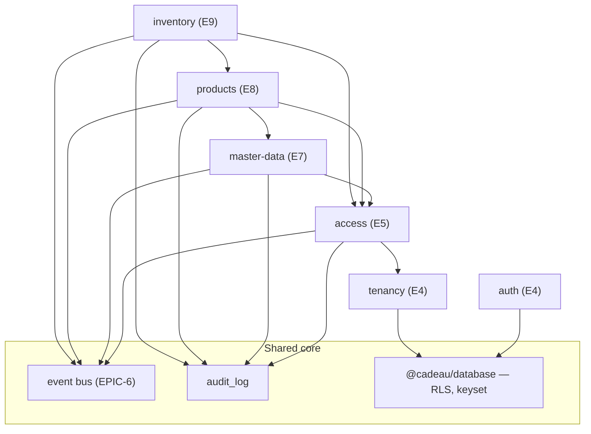

# Domain Map — Cadeau CRM

**As of:** end of EPIC-9 — 2026-07-31 · 7 delivered modules · 33 tables · 49 endpoints.

One page that answers "what exists, what owns what, and what depends on what."
Read it before starting a new epic — it is how you find the seam to attach to
instead of inventing a new one. Per-module detail lives in
[api/](api/README.md) (contracts) and the domain docs linked below.

---

## 1. Layer map

```
                     ┌──────────────────────────────────────────┐
   Domain modules    │ products · inventory                     │  EPIC-8, 9
                     │ (customers · orders · shipping ·         │  EPIC-10..15
                     │  finance · analytics · notifications)    │  (planned)
                     └───────────────────┬──────────────────────┘
                                         │ consumes
                     ┌───────────────────┴──────────────────────┐
   Platform modules  │ master-data · access · tenancy · auth    │  EPIC-4, 5, 7
                     └───────────────────┬──────────────────────┘
                                         │ built on
                     ┌───────────────────┴──────────────────────┐
   Shared core       │ event bus (EPIC-6) · audit_log ·         │
                     │ unified errors · RLS + keyset helpers    │
                     │ (@cadeau/config, @cadeau/crypto,         │
                     │  @cadeau/database)                       │
                     └──────────────────────────────────────────┘
```

Nothing points upward. A domain module may consume platform modules and the shared
core; a platform module never imports a domain module.

## 2. Delivered modules

| Module        | Epic | Base path(s)                      | Owns (tables)                                                                                                                                                                                                        | Events                                        |
| ------------- | ---- | --------------------------------- | -------------------------------------------------------------------------------------------------------------------------------------------------------------------------------------------------------------------- | --------------------------------------------- |
| `auth`        | 4    | `/v1/auth`                        | `profiles`, `sessions`                                                                                                                                                                                               | —                                             |
| `tenancy`     | 4    | `/v1/companies` …                 | `companies`, `company_members`, `invitations`                                                                                                                                                                        | —                                             |
| `access`      | 5    | `/v1/access`, `/v1/admin`         | `features`, `plans`, `plan_features`, `permissions`, `feature_permissions`, `permission_templates`, `role_permissions`, `platform_admins`, `subscriptions`, `company_feature_flags`, `add_ons`, `member_permissions` | `subscription.changed`, access `*` (additive) |
| `master-data` | 7    | `/v1/master-data`                 | `currencies`, `country_configs`, `governorates`, `units`, `product_categories`, `order_labels`, `order_reasons`, `shipping_zones`                                                                                    | `master_data.changed`                         |
| `products`    | 8    | `/v1/products`                    | `products`, `product_variants`                                                                                                                                                                                       | `product.created` / `.updated` / `.archived`  |
| `inventory`   | 9    | `/v1/warehouses`, `/v1/inventory` | `warehouses`, `inventory_stock`, `stock_reservations`, `stock_transfers`, `stock_adjustments`                                                                                                                        | `stock.changed`, `stock.low`                  |
| `health`      | 1    | `/health`                         | —                                                                                                                                                                                                                    | —                                             |

Shared, owned by no feature module: `audit_log` (append-only, written by every
module before it emits).

## 3. Dependency graph (delivered)



Read an arrow as "depends on". Every module depends on `@cadeau/database` for the
tenant context, keyset helpers, and audit write; the edges above show the
_feature-level_ dependencies that matter when planning.

## 4. The four cross-cutting seams

Every module attaches through the same four seams. A new epic that needs a fifth
seam should be treated as a core change and reviewed as such.

1. **Access (EPIC-5, three-layer).** Feature enabled for the plan → permission
   granted to the member → route gated. Feature keys and `read`/`manage`
   permissions are seeded from
   [`packages/database/src/seed/access/catalog.ts`](../packages/database/src/seed/access/catalog.ts).
   All 16 epics' feature keys are **already in the catalog** — a new domain module
   normally adds no catalog row.
2. **Tenant isolation (ADR-0001/0003).** Two layers, always: Postgres `FORCE` RLS
   by `company_id`, plus repository-side `setTenantContext` + `companyId` filter.
   The tenant comes from the token, never the payload.
3. **Audit-then-emit (ADR-0004).** Every write appends an `audit_log` row first
   (source of truth), then publishes on the in-process typed bus (additive). The
   event catalog in
   [`apps/api/src/shared/events/event-catalog.ts`](../apps/api/src/shared/events/event-catalog.ts)
   is **closed** — reserved names exist for the unbuilt epics.
4. **Keyset lists.** No OFFSET anywhere. Every list is cursor-paginated over a
   covering index; the cursor is opaque and tamper-detected (`400`).

## 5. Data-flow spine

The delivered half of the product is the _catalog → stock_ spine:

```
master-data (units, categories)
        │ classifies
        ▼
    products ── variants ────────────┐
        │  allow_oversell            │ counted in
        ▼                            ▼
   averageCost  ◀── EPIC-13    inventory_stock (per warehouse × variant)
   (derived)                         │ moved by
                                     ▼
             reservations · transfers · adjustments  (atomic, logged)
                                     │ emits
                                     ▼
                       stock.changed / stock.low
```

Everything still to be built hangs off the right-hand side of that diagram: orders
consume reservations, finance posts cost into `averageCost`, analytics reads the
levels, notifications listen to `stock.low`.

## 6. Planned modules and where they attach

| Epic | Module          | Attaches to                                                                     | New tables (planned)                                 |
| ---- | --------------- | ------------------------------------------------------------------------------- | ---------------------------------------------------- |
| 10   | `customers`     | master-data (governorates), access, bus                                         | customers, customer addresses (merge deferred to 11) |
| 11   | `orders`        | customers, products, **inventory (reservations)**, master-data (labels/reasons) | orders, order lines, order activity                  |
| 12   | `shipping`      | orders, master-data (shipping zones)                                            | carriers, shipments, webhook events                  |
| 13   | `finance`       | products (`averageCost`), inventory (receipts raise stock), orders, shipping    | suppliers, POs, expenses, invoices, cash             |
| 14   | `analytics`     | reads across orders / products / inventory / finance                            | cached aggregates                                    |
| 15   | `notifications` | the event bus (`stock.low`, order events)                                       | notifications, preferences, delivery queue           |
| 16   | —               | launch gate over everything                                                     | —                                                    |

## 7. Forward references already in the schema

Deliberate, documented, and unenforced until their epic lands:

| Reference                       | Waiting on | Note                                     |
| ------------------------------- | ---------- | ---------------------------------------- |
| `stock_reservations.order_id`   | EPIC-11    | No FK until `orders` exists.             |
| `product_variants.average_cost` | EPIC-13    | Derived, read-only, no write path yet.   |
| `order_labels`, `order_reasons` | EPIC-11    | Seeded master data with no consumer yet. |
| `shipping_zones`                | EPIC-12    | Same.                                    |
| `ai` feature (inactive)         | never      | ADR-0004 — kept inactive by design.      |

## 8. Where to read more

- Domain models: [product-domain.md](product-domain.md),
  [inventory-domain.md](inventory-domain.md),
  [permission-matrix.md](permission-matrix.md)
- Reviews: [access-review.md](access-review.md),
  [products-review.md](products-review.md),
  [inventory-review.md](inventory-review.md)
- Contracts: [api/README.md](api/README.md) · Events: [events.md](events.md)
- Rules: [adr/](adr/README.md), [api-conventions.md](api-conventions.md),
  [extensibility.md](extensibility.md)
- Live state: [execution-plan.md](execution-plan.md) §0 ·
  [project-metrics.md](project-metrics.md)
